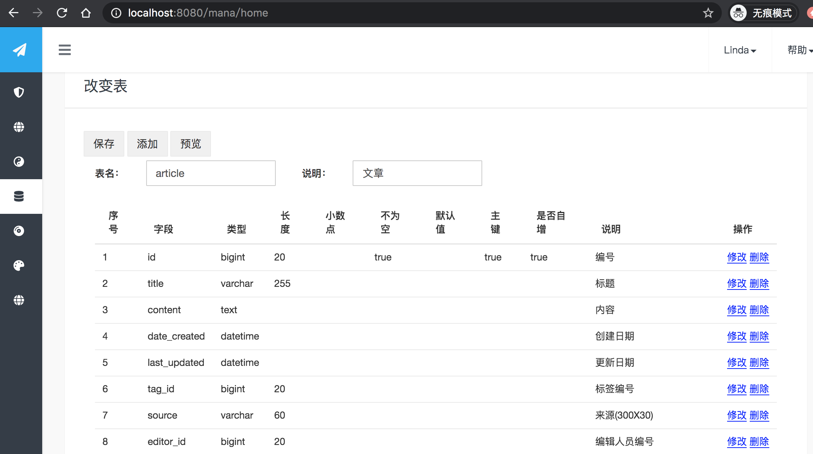
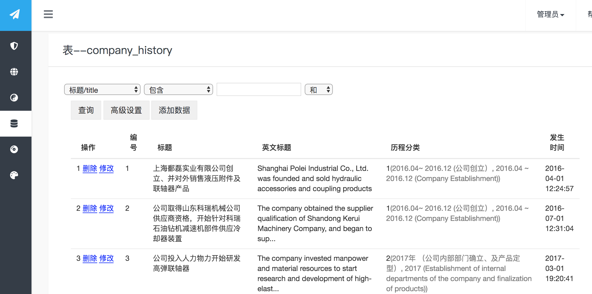
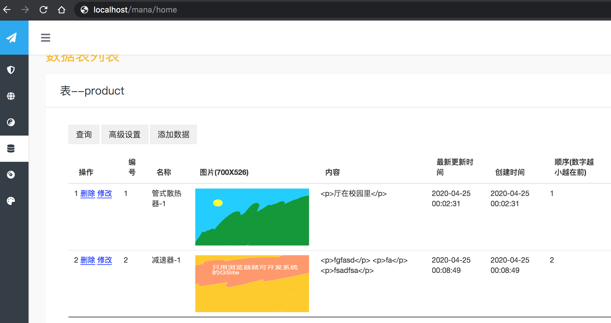
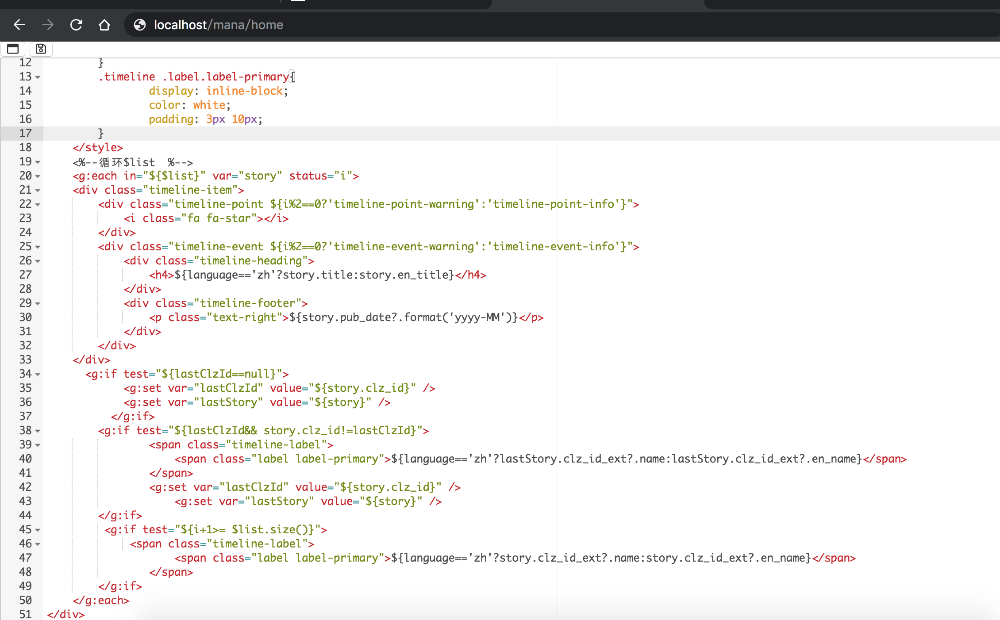
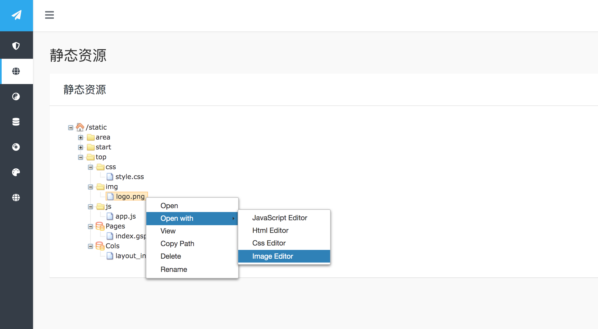
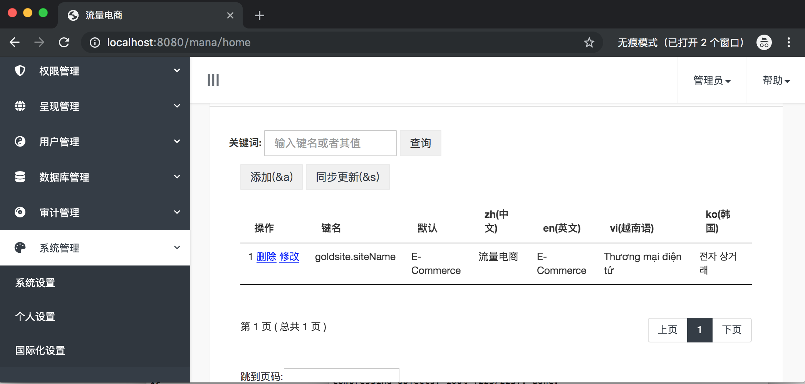
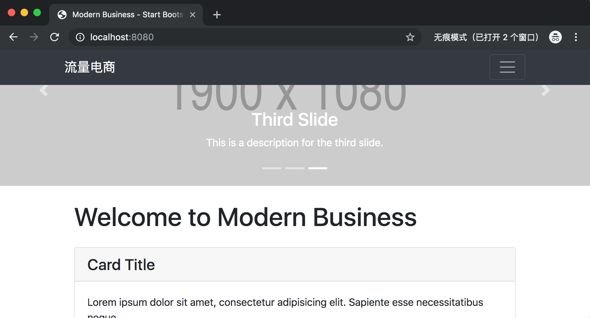


  
GSite   [English Edition](README_eng.md)
================================================  

GSite，是新一代快速通用建站工具，是一个既能快速开发，又能够随时快速响应业务变化和易于维护的平台,是专为新一代网络而设计的平台。


GSite平台支持如下：  

1. GSite是一个高效全栈开发和建站工具，从数据表设计，与功能实现，到部署应用，只需浏览器即可，无需其它开发工具；

2. GSite开发的网站，所有页面模板/皮肤及内容，都可以100％即时在线更改和添加且能即时生效，并能同步到其它集群机器，且完全无需部署和重启；  
  
3. 我们的呈现管理（静态资源＼菜单＼页面＼栏目＼处理器＼过滤器），可以将你的数据表数据，很容易按照单条＼多条＼分页，呈现成网页形式，或者JSON接口数据模式；  
  
4. 你需要的新功能或者修改老的功能，创建表或者修改表字段，将是很简单的事情。无需编写增删改查功能，也无需重启和部署，就可以对数据进行任何编辑和查询（内含可视查询设计器）操作； 
  
5. 支持在线实时更新i18n信息和文字,支持任意多语言；
  
6. 非常简单和便利、完整的GSite模板/皮肤制作、打包、导入工具；  

7. 可以同时支持Ｎ个独立网站，让资源充分利用，创造最大价值；
  
8. 最后强调的是，GSite 不是一个wordpress,不是一个cms，可以是任何类型系统，类似于开发框架一样，是一个通用且能实时响应的快速建站平台。  

  
  
希望大家多多支持!如果有可能，还请多多直抒产品意见和建议！  


使用准备  
===========  
需要mysql5.0以上服务器,JDK 1.8及以上。  
  
GSite标准版下载和安装  
=====  

绝大数人都只需下载GSite标准版使用，大家可以从[这里](https://github.com/TheGoldData/gsite/releases) 下载; 也可在百度网盘下载链接(https://pan.baidu.com/s/134-kY9uHZh0e3YzBkEG0Jg  提取码：tyl6 )  

程序下载解压之后，首先运行bin/setup.bat（或bin/setup.sh）执行安装和配制。如果是linux或者mac,则还需要赋予可执行权限 chmod a+x bin/*。  
  
这个向导程序会引导你进行数据库脚本导入。  
  
上手使用  
====  
完成之后，就可以在项目根路径下，运行项目：

```bash
java -jar app.war
```

或者是将war包放入tomcat里运行。  
  
运行起来之后，就可以照着控制台提示的地址，进行访问。 

注：而对于高级版，则见在线文档说明。
 
**效果图**

创建和修改表


查询表




页面和代码编辑


静态资源编辑


i18n编辑：



以下是访问默认自带的前端截图示例：



技术交流与商业合作
===

QQ群，1036220766

文档  
==== 
 
请在[这里](https://goldsite.100shouhou.com/docs) 查看文档。

更多内容请上金色数据官网 https://goldsite.100shouhou.com/


试一试
===
如果你没有服务器，本系统还可以放在免费的heroku服务器上运行建站。详情请见文章和ＱＱ群。

当然，你也可以放在本地电脑中运行建站。

关于许可证  
============  
我们提供了免费的临时许何证，你可以在[官网]( https://goldsite.100shouhou.com/)随时申请。
  