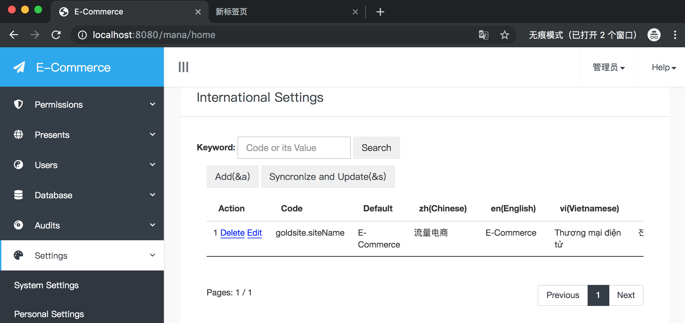

  
  
GSite   [中文](README_zh.md)
==========================  
  
GSite is a new-generation tool for building various websites . and it is an easy quickly building tool and can be agile and quickly responsible for your business.

The main features of GSite are listed as below:

1. The websites which are developed by the GSite tool, those whole pages and contents can be changed and updated 100% completely online and automatically 
synchronized to other machines of its cluster,without any needs to redeploy and restart.

2. Our GSite can make your any data from database render it out as a JSON format or web pages.

3. Generally, you don't need to program "add/update/delete/query"  codes for something new, and also no needs to redeploy and restart. 
You only need something to do is to create your new tables in the database,then  you can directly 
manipulate any data from the database.

4. Fully support i18n messages and characters to add and update online. We hope people around the world can go abroad to bring your money abroad to your motherland.

5. Simple and complete theme tools which include "theme make/theme zip/theme change".

6. GSite is not a wordpress ,or a cms tool. It can be used to build any type of websites like other web frameworks.
  
  
Prerequisites  
============= 

MySQL 5.0+ Server/Java SDK 1.8+
  
Installation 
============  
  
After you download and unzip the file. You can go to the GSite folder, and open your shell, runs setup.bat from directory bin/ to guide you a install process.

This guide will create a project, make the database import ,and one theme import for you. 

Get Started
===========
  
After installation above, you can build your new project with gradle, and then run as below:

```bash
gradle clean build -x test

java -jar <your project war >
```

Or it can be run with grails directly :

```bash
grails run-app
```

Or you can put the war above into tomcat to run.
  
Once you finish to start the program, you can get access the website you just create and run.

Screenshot at the front：


Screenshot at the manager：



License
=======
You can apply for free temporary licenses at the official website at any time. You can also buy license to support the GSite project.
 
Documentation  
=============  

### Videos

[Download and Setup](https://goldsite.100shouhou.com/video?id=1)

[Run Your Project](https://goldsite.100shouhou.com/video?id=2)

[Make Your Theme](https://goldsite.100shouhou.com/video?id=3)

[Bundle and Publish Your Theme](https://goldsite.100shouhou.com/video?id=4)

[Switch Your Theme](https://goldsite.100shouhou.com/video?id=5)

If you want to get more, please see it at https://goldsite.100shouhou.com/